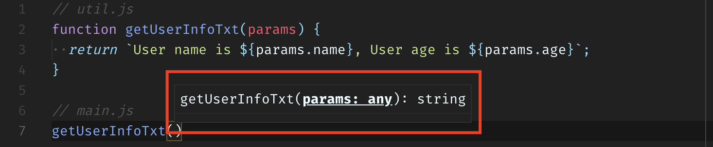
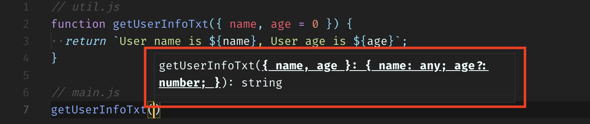

JavaScript es un de los lenguajes mas usados hoy en día, se puede emplear en cualquier tipo de desarrollo que se desee en diferentes tipos de plataformas, yo personalmente, lo uso constantemente en mi trabajo o en cualquier proyecto que decido emprender, es un lenguaje que se mantiene en constante evolución y crecimiento gracias a la enorme comunidad al rededor, si bien el lenguaje no ha cambiado mucho a lo largo de los años a comparación de otros lenguajes de programación, hay algunos cambios recientes que vale la pena tomar cuenta debido al poder expresivo que agregan al lenguaje, esta vez me gustaría hablarles del _destructuring_, puede que algunos de ustedes ya lo dominen, sin embargo quisiera contarles lo que me parece útil de algunos de los usos que se le puede dar.

El objetivo de este articulo no es entrar en el detalle técnico del _destructuring_, sino contarles en lo personal, lo que me parece útil de esta funcionalidad y como lo aplico en los proyectos en los que estoy involucrado, tengo ya algunos años trabajando con JavaScript y sinceramente el uso que le venia dando al _destructuring_ era demasiado básico, sin darme cuenta de los grandes beneficios que te trae dominar este tema.

Empecemos por un ejemplo sencillo que estoy seguro se les ha presentado a muchos de ustedes:

```javascript{numberLines: true}
function drawChart(options) {
  options = options || {};

  const cordX = options.cords.x || 0;
  const cordY = options.cords.y || 0;
  const radius = options.radius || 35;

  // Finalmente hacer uso de los datos
  console.log(options.size, cordX, cordY, radius);
}

drawChart({
  size: 'big',
  cords: {
    x: 50,
    y: 50
  }
});

// "big" 50 50 35
```

Del ejemplo anterior lo primero que les quiero decir es que es la forma en la que he hecho las cosas la mayoría de las veces :laughing:, y con esto no quiero decir que este mal hecho, de una u otra forma se puede obtener el mismo resultado, lo importante es hacerlo de la forma mas optima posible.

Es conveniente tener en cuenta algunos detalles del fragmento de código anterior, si el objeto `cords` al que estamos accediendo esta profundamente anidado en otro objeto, la cadena de acceso al objeto se hace más larga, lo que podría significar mas lineas de código y posibles errores, ya que en la mayoría de los casos algunas de las propiedades dentro del objeto son opcionales, y para cualquier dato que deseemos obtener siempre tendríamos que estar validado que no se acceda a una propiedad que es `undefined`.

## Y entonces, de qué se trata el destructuring?

Básicamente, implica descomponer una estructura compleja en partes mas simples. En JavaScript, esas estructuras hacen referencia a un objeto o a un array.

Del ejemplo anterior parte el primer uso que me parece importante resaltar del _destructuring_, y es precisamente como se puede usar al momento de obtener parámetros en un método, miremos como podemos alcanzar el mismo resultado haciendo uso del _object destructuring_:

```javascript{numberLines: true}
function drawChart({ size, radius = 35, cords: { x = 0, y = 0 } } = {}) {
  console.log(size, radius, x, y);
}

drawChart({
  size: 'big',
  cords: {
    x: 50,
    y: 50
  }
});

// "big" 50 50 35
```

Lo primero que podemos notar es que el cuerpo del método se redujo bastante, pudimos obtener el mismo resultado con menos lineas de condigo. A primera vista es mucho mas clara la estructura de entrada del objeto, en caso de que el cuerpo del método se extienda por mas lineas, desde el principio podemos tener un acercamiento a cuales son las posibles propiedades que se están usando dentro del método, esto me parece una gran ventaja. Lo segundo, es el hecho de que podemos asignar valores por defecto a dichas propiedades al momento de hacer el _object destructuring_, esta es una de las cosas de las que yo no usaba mucho y se ha convertido en algo fundamental al momento de estar programando, pienso que el código se ve mas limpio y entendible.

Algo que si cambio dentro del cuerpo del método, es que las variables `cordX` y `cordY` ya no existen, esta claro que el ejemplo que yo les estoy mostrando en bastante sencillo, pero habrán momentos en los que se necesita usar un nombre diferente para dichas propiedades dentro del cuerpo de nuestro método, veamos cual seria la posible forma de obtener dicho resultado:

```javascript{numberLines: true}
function drawChart({ size, radius = 35, cords: { x = 0, y = 0 } } = {}) {
  const cordX = x;
  const cordY = y;

  console.log(size, radius, cordX, cordY);
}

drawChart({
  size: 'big',
  cords: {
    x: 50,
    y: 50
  }
});

// "big" 50 50 35
```

Parece simple, pero de nuevo, no es la forma mas optima de hacer las cosas, otra de las ventajas del _object destructuring_ es la posibilidad de renombrar variables.

```javascript{numberLines: true}
function drawChart({
  size,
  radius = 35,
  cords: { x: cordX = 0, cordY = 0 }
} = {}) {
  console.log(size, radius, cordX, cordY);
}

drawChart({
  size: 'big',
  cords: {
    x: 50,
    y: 50
  }
});

// "big" 50 50 35
```

Han habido momentos en los que ha sido de gran utilidad renombrar variables, un ejemplo que se acerca mas a la realidad es cuando consumimos un API, si dicho API fue programado por terceros, es posible que nos encontremos con nombres de variables que no son muy descriptivos o incluso no dicen nada acerca del dato que llega dentro del cuerpo de respuesta, el algunos casos me he encontrado con nombres mal escritos, eso podría afectar un poco la implementación de nuestro método en términos de lectura y entendimiento, miremos un ejemplo:

```javascript{numberLines: true}
function displayUserInfo({
  age,
  // highlight-start
  name: fullname,
  pro: profession,
  img: avatarImgUrl
  // highlight-end
}) {
  console.log(
    `I am ${fullname}, I am ${age} years old and I work as a ${profession}`
  );
}

displayUserInfo({
  name: 'John Smith',
  age: 22,
  pro: 'Front-End Developer',
  img: '/profile.jpg'
});

// I am John Smith, I am 22 years old and I work as a Front-End Developer
```

En este ejemplo sencillo podemos ver como los nombres que asignamos a las propiedades del objeto son mucho mas descriptivos que los que vienen por defecto, de esta manera al momento de usarlas dentro del cuerpo del método, el código es mucho mas legible y fácil de entender.

## Tipado y editores de código

En mi opinión uno de los grandes retos cuando estas trabajando con JavaScript, es el hecho de que algunas veces nos cuesta entender el comportamiento de un método en base a los argumentos que recibe a primera vista.

en lo personal cuando me encuentro trabajando con JavaScript, en algunos momentos es difícil entender el comportamiento de un método en base a los parámetros que recibe.



Esta imagen la tome del editor de código que yo uso (vscode), al llamar al método me sale una ayuda diciéndome que el método recibe un argumento `params` de cualquier tipo, lo cual no me dice mucho, la única manera de ver que propiedades tiene el objeto que debo enviar es ir al archivo donde esta el método y ver el comportamiento que tiene, hacer esto nos quita un tiempo valioso, con la ayuda del _object destructuring_ se puede evitar.



Como podemos ver, ahora es un poco mas fácil saber que estructura debe tener el objeto que recibe el método como parámetro, incluso cuando asignamos un valor por defecto a alguna de las propiedades del objeto nos lo indica y nos dice que tipo de variable es (`number` para la propiedad `age`).
